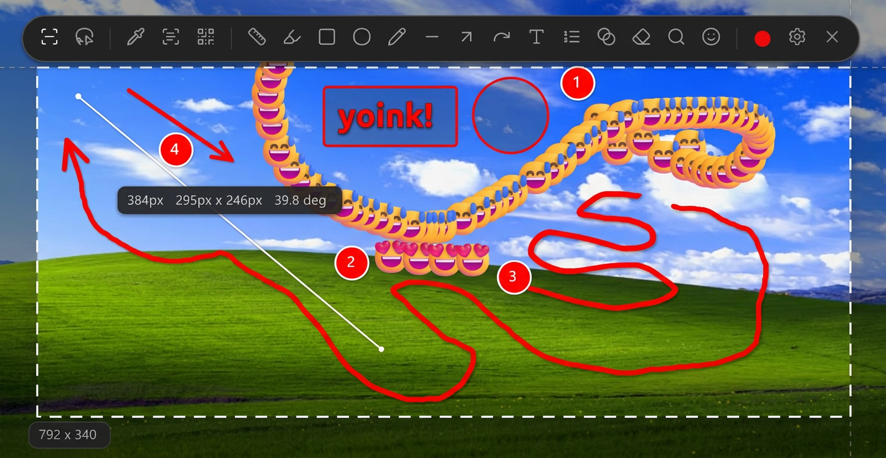
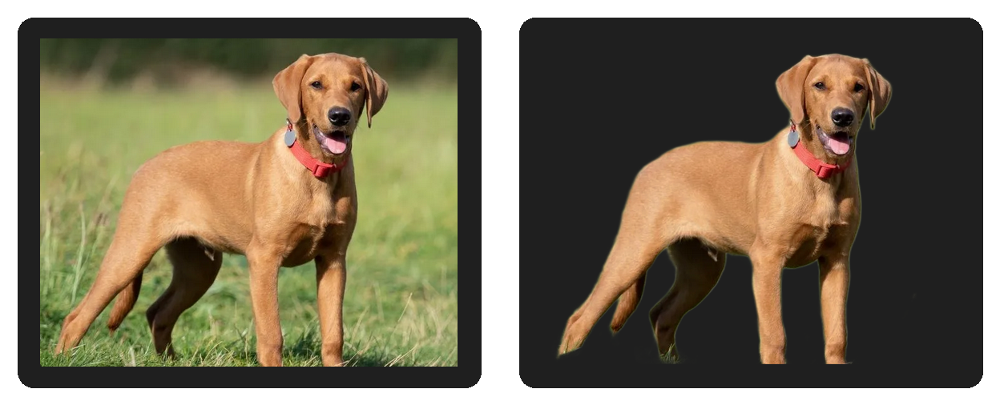

<p align="center">
  
</p>

<p align="center">
  <strong>Yoink: All-in-one open-source fast, clean ShareX alternative</strong>
</p>

<p align="center">
  Capture, annotate, OCR, make stickers, record video, drag out, save locally, and move on.
</p>

<p align="center">
  <a href="https://github.com/jasperdevs/yoink/releases/latest">
    
  </a>
  <a href="https://github.com/jasperdevs/yoink/releases">
    
  </a>
  <a href="https://github.com/jasperdevs/yoink/stargazers">
  
</a>
  <a href="https://github.com/jasperdevs/yoink/blob/main/LICENSE">
    
  </a>
</p>


<p align="center">
  <a href="https://github.com/jasperdevs/yoink/releases/latest">
    
  </a>
  
  
</p>

<p align="center">

</p>

Yoink is a free, open-source screenshot tool that stays out of the way until you need it. Capture part of the screen, mark it up, copy it, save it, drag it out, record it, or upload it without breaking your flow.

## Download

Grab the latest release from the [**Releases page**](https://github.com/jasperdevs/yoink/releases/latest)

## Why Yoink

- Fast region, fullscreen, active-window, and scroll capture with window snapping and a tray-first workflow
- Built-in annotation tools and configurable toolbar hotkeys for quick explanations and feedback
- OCR, color picking, QR/barcode scanning, stickers, and screen recording with GIF/MP4/WebM/MKV output
- Drag-and-drop preview plus local history for images, text, colors, stickers, and recordings
- Optional uploads for screenshots, stickers, and recordings to public hosts, cloud storage, or self-hosted targets
- More to come (and more i didnt mention lol)

## Stickers

Yoink can turn captures into stickers by removing the background, then saving, previewing, copying, and uploading them like normal images.

<p align="center">
  
</p>

- Cloud sticker providers: `remove.bg`, `Photoroom`
- Local sticker models: `U2Netp`, `BRIA RMBG`
- Optional sticker finishing: drop shadow and white stroke

## Default hotkeys

| Action | Hotkey |
|---|---|
| Screenshot | `Alt + `` ` |
| OCR | `Alt + Shift + `` ` |
| Color picker | `Alt + C` |
| QR/barcode scanner | `Unassigned` |
| Sticker | `Unassigned` |
| Fullscreen capture | `Unassigned` |
| Active window capture | `Unassigned` |
| Scroll capture | `Unassigned` |
| Ruler | `Unassigned` |
| Record | `Unassigned` |
| Annotation tools | `1-9`, `0`, `-`, `=`, `[`, `]`, `\` |

Annotation tool hotkeys are assigned in toolbar order, so the exact tool on each key depends on which tools are enabled.

Hotkeys can be changed in settings.

## Build from source

```
git clone https://github.com/jasperdevs/yoink.git
cd yoink
dotnet publish src/Yoink/Yoink.csproj -c Release -r win-x64 --self-contained true -p:PublishSingleFile=true -o release
```

Requires [.NET 9 SDK](https://dotnet.microsoft.com/download/dotnet/9.0).

## Uploads

Yoink can upload screenshots, stickers, and recordings after capture. Upload targets include:

- Public hosts like `Imgur`, `ImgBB`, `Catbox`, `Litterbox`, `Gyazo`, `file.io`, and `Uguu`
- Cloud targets like `Dropbox`, `Google Drive`, `OneDrive`, `Azure Blob`, and `S3-compatible storage`
- Self-hosted and developer targets like `GitHub`, `Immich`, `FTP`, `SFTP`, `WebDAV`, and `Custom HTTP`

Availability depends on the target service and your credentials.

Sticker uploads use the same upload destinations as normal image uploads.

## License

[MIT](LICENSE)

## Star History

<a href="https://www.star-history.com/?repos=jasperdevs%2Fyoink&type=timeline&legend=top-left">
 <picture>
   <source media="(prefers-color-scheme: dark)" srcset="https://api.star-history.com/image?repos=jasperdevs/yoink&type=timeline&theme=dark&legend=top-left" />
   <source media="(prefers-color-scheme: light)" srcset="https://api.star-history.com/image?repos=jasperdevs/yoink&type=timeline&legend=top-left" />
   
 </picture>
</a>

<a href="https://www.producthunt.com/products/yoink-5?embed=true&amp;utm_source=badge-featured&amp;utm_medium=badge&amp;utm_campaign=badge-yoink-7" target="_blank" rel="noopener noreferrer"></a>

