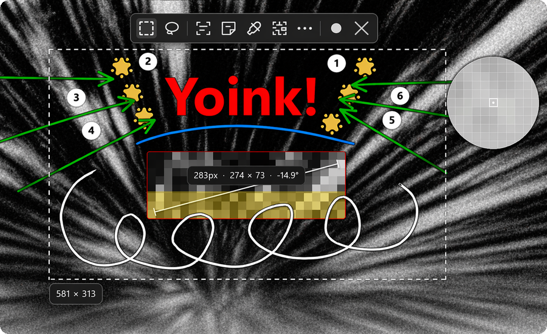

<p align="center">
  <picture>
    <source media="(prefers-color-scheme: dark)" srcset="assets/oddsnap-square-dark.png" />
    
  </picture>
</p>
<p align="center">
  <picture>
    <source media="(prefers-color-scheme: dark)" srcset="assets/oddsnap.png" />
    
  </picture>
</p>
<p align="center"> Free, open-source screenshot tool. Capture, annotate, share, search with OCR, record, scrolling captures, translations, color picker, upscale, and MUCH more </p>

<p align="center">
  <a href="https://github.com/jasperdevs/odd-snap/releases/latest">
    
  </a>
  
  
</p>

<p align="center">
  <a href="https://github.com/jasperdevs/odd-snap/releases">
    
  </a>
  <a href="https://github.com/jasperdevs/odd-snap/releases/latest">
    
  </a>
  <a href="https://github.com/jasperdevs/odd-snap/stargazers">
    
  </a>
</p>

<p align="center">
  
</p>

## Download

Grab the latest release from the [**Releases page**](https://github.com/jasperdevs/odd-snap/releases/latest).

## Winget

```powershell
winget install --id JasperDevs.OddSnap -e
winget upgrade --id JasperDevs.OddSnap -e
```

## Features

<p align="center">
  <strong>Explore all features, screenshots, and downloads on the website.</strong>
  <br />
  <a href="https://jasperdevs.github.io/odd-snap/">jasperdevs.github.io/odd-snap</a>
</p>

<p align="center">
<a href="https://star-history.com/#jasperdevs/odd-snap&Date">
 <picture>
   <source media="(prefers-color-scheme: dark)" srcset="https://api.star-history.com/svg?repos=jasperdevs/odd-snap&type=Date&theme=dark" />
   <source media="(prefers-color-scheme: light)" srcset="https://api.star-history.com/svg?repos=jasperdevs/odd-snap&type=Date" />
   
 </picture>
</a>
</p>

## License

OddSnap is open source under [GPL-3.0-or-later](LICENSE).
