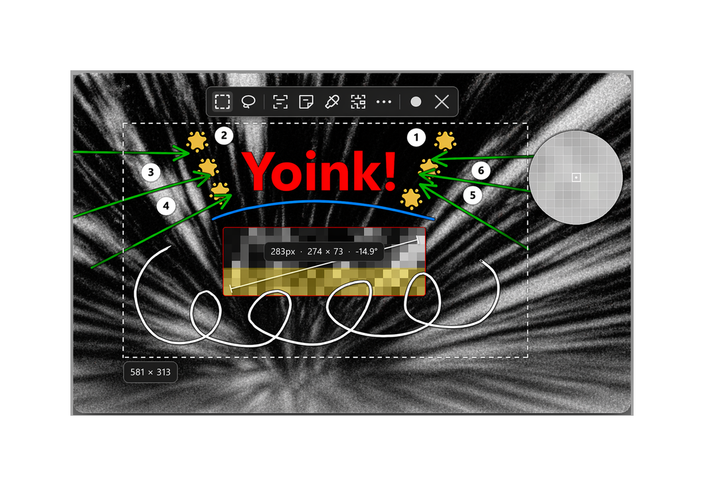
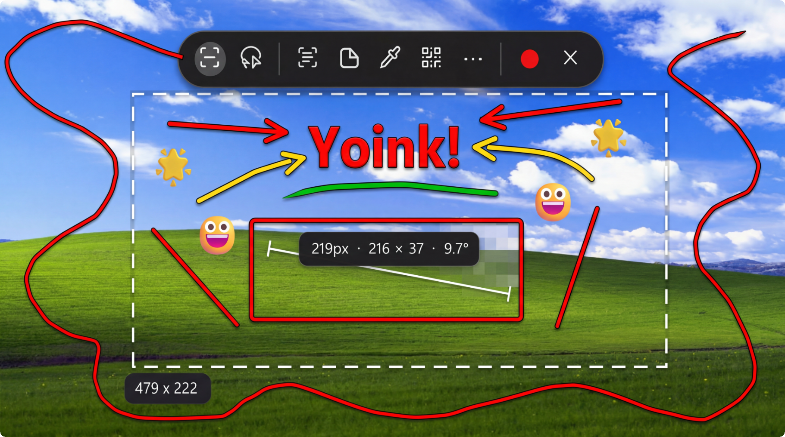
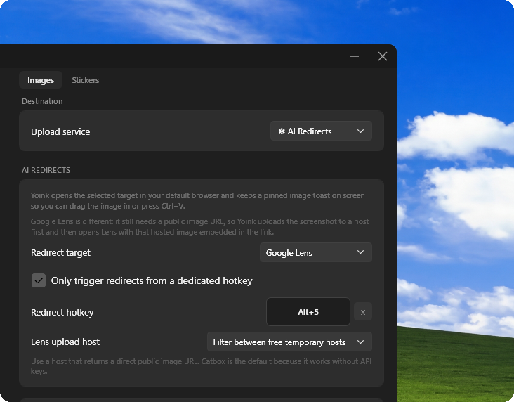
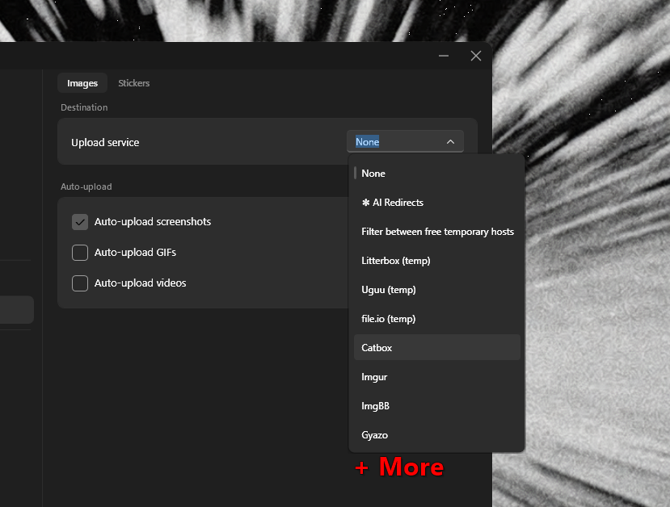
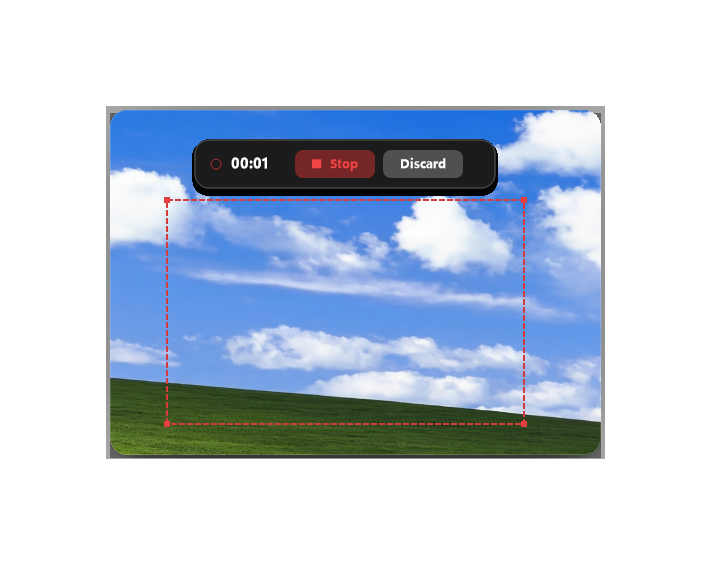
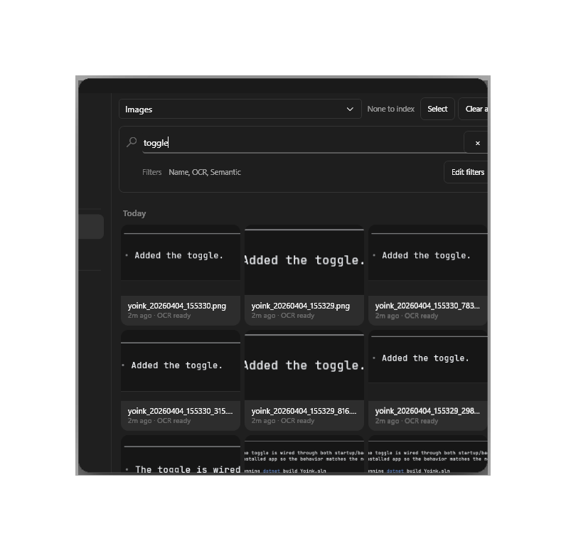
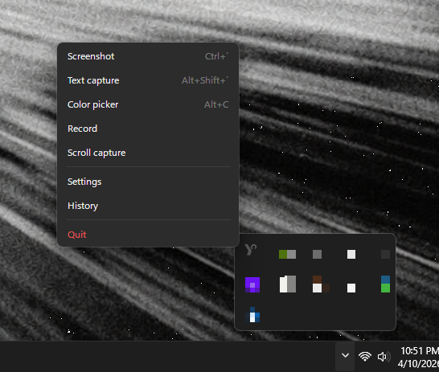

<h1 align="center">yoink</h1>
<p align="center">An open-source ShareX alternative for capture, annotation, OCR, translation, stickers, recording, uploads, and searchable history.</p>

<p align="center">
  <a href="https://github.com/jasperdevs/yoink/releases/latest">
    
  </a>
  
  
</p>

<p align="center">
  <a href="https://github.com/jasperdevs/yoink/releases">
    
  </a>
  <a href="https://github.com/jasperdevs/yoink/stargazers">
    
  </a>
</p>

<p align="center">
  
</p>

## Download

Grab the latest release from the [**Releases page**](https://github.com/jasperdevs/yoink/releases/latest).

## Winget

```powershell
winget install --id JasperDevs.Yoink -e
winget upgrade --id JasperDevs.Yoink -e
```

## Features

<table>
<tr>
<td width="40%" valign="middle">
<h3>Capture modes</h3>
Region, fullscreen, active-window, and scrolling capture in one ShareX-style workflow.
</td>
<td width="60%">

</td>
</tr>
<tr>
<td width="40%" valign="middle">
<h3>AI Redirects</h3>
Open ChatGPT, Claude, Gemini, or Google Lens right after capture, then keep the image pinned and ready to drag or paste into the chat box.
</td>
<td width="60%">

</td>
</tr>
<tr>
<td width="40%" valign="middle">
<h3>Sticker creation</h3>
Remove backgrounds and turn screenshots into polished stickers with optional stroke and shadow finishing.
</td>
<td width="60%">

</td>
</tr>
<tr>
<td width="40%" valign="middle">
<h3>OCR + translation</h3>
Extract text from any screen region into a dedicated result window where you can edit, copy, and translate with local or cloud-backed providers.
</td>
<td width="60%">

</td>
</tr>
<tr>
<td width="40%" valign="middle">
<h3>Global hotkeys + tray</h3>
Launch capture, OCR, color picking, recording, history, and more from system-wide hotkeys or the tray menu without breaking your flow.
</td>
<td width="60%">

</td>
</tr>
<tr>
<td width="40%" valign="middle">
<h3>Recording</h3>
Record GIFs and videos in multiple formats with optional microphone and desktop audio capture.
</td>
<td width="60%">

</td>
</tr>
<tr>
<td width="40%" valign="middle">
<h3>Searchable history</h3>
Find past captures by filename, OCR text, or semantic similarity so you can recover screenshots by meaning, not just date.
</td>
<td width="60%">

</td>
</tr>
<tr>
<td width="40%" valign="middle">
<h3>Built-in annotation</h3>
Arrows, text, shapes, blur, and freehand markup are built into the same fast capture workflow with cleaner stroke and shadow effects.
</td>
<td width="60%">

</td>
</tr>
<tr>
<td width="40%" valign="middle">
<h3>100+ OCR languages</h3>
Download language packs on demand for multilingual OCR and translation workflows without turning the app into a cloud-only tool.
</td>
<td width="60%">

</td>
</tr>
<tr>
<td width="40%" valign="middle">
<h3>Utility tools</h3>
Color picker, QR and barcode scanning, ruler tools, and step numbering live alongside capture instead of being split across separate apps.
</td>
<td width="60%">

</td>
</tr>
<tr>
<td width="40%" valign="middle">
<h3>Flexible uploads</h3>
Upload screenshots, stickers, and recordings to Imgur, ImgBB, Catbox, Litterbox, Gyazo, file.io, Uguu, tmpfiles.org, transfer.sh, Dropbox, Google Drive, OneDrive, Azure Blob, GitHub, Immich, FTP, SFTP, WebDAV, S3 / R2 / B2, and Custom HTTP from the same post-capture flow.
</td>
<td width="60%">

</td>
</tr>
</table>

<a href="https://star-history.com/#jasperdevs/yoink&Date">
 <picture>
   <source media="(prefers-color-scheme: dark)" srcset="https://api.star-history.com/svg?repos=jasperdevs/yoink&type=Date&theme=dark" />
   <source media="(prefers-color-scheme: light)" srcset="https://api.star-history.com/svg?repos=jasperdevs/yoink&type=Date" />
   
 </picture>
</a>

## License

yoink is open source under [GPL-3.0-or-later](LICENSE).
