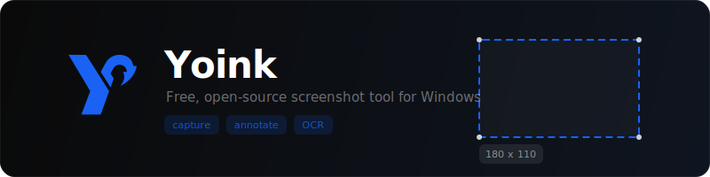

<p align="center">
  
</p>

<p align="center">
  <strong>Fast screenshot capture, annotation, and sharing for Windows</strong>
</p>

<p align="center">
  <a href="https://github.com/jasperdevs/yoink/releases/latest"></a>
  <a href="https://github.com/jasperdevs/yoink/releases/latest"></a>
  <a href="https://github.com/jasperdevs/yoink/blob/main/LICENSE"></a>
  
</p>

<br/>

Yoink is a free, open-source screenshot tool for Windows that stays out of the way until you need it. Capture part of the screen, mark it up, copy it, save it, drag it out, or upload it without breaking your flow.

## Download

Grab the latest release from the [**Releases page**](https://github.com/jasperdevs/yoink/releases/latest). Extract the zip and run `Yoink.exe`.

## Features

- **Capture modes** — region capture with window detection, freeform lasso, fullscreen, OCR text extraction, color picker, QR/barcode scanning, and GIF recording

- **Annotation tools** — draw, lines, arrows, curved arrows, text with inline formatting, highlight, rectangle and circle shapes, step numbers, blur, eraser, magnifier, emoji stamps, and system font search

- **Workflow** — auto-copy to clipboard, floating drag-and-drop preview, local history, quick save, customizable toolbar and hotkeys, and tray-first behavior

- **Uploads** — optional upload support for screenshots and GIFs with public hosts, cloud storage, and self-hosted targets

## Default hotkeys

| Action | Hotkey |
|---|---|
| Screenshot | `Alt + `` ` |
| OCR | `Alt + Shift + `` ` |
| Color picker | `Alt + C` |

Hotkeys can be changed in settings.

## Build from source

```
git clone https://github.com/jasperdevs/yoink.git
cd yoink
dotnet publish src/Yoink/Yoink.csproj -c Release -r win-x64 --self-contained true -p:PublishSingleFile=true -o release
```

Requires [.NET 9 SDK](https://dotnet.microsoft.com/download/dotnet/9.0).

## Uploads

Yoink can upload screenshots and GIFs after capture. Upload targets include:

- Public hosts like `Imgur`, `ImgBB`, `Catbox`, `Litterbox`, `Gyazo`, `file.io`, and `Uguu`
- Cloud targets like `Dropbox`, `Google Drive`, `OneDrive`, `Azure Blob`, and `S3-compatible storage`
- Self-hosted and developer targets like `GitHub`, `Immich`, `FTP`, `SFTP`, `WebDAV`, and `Custom HTTP`

Availability depends on the target service and your credentials.

## License

[MIT](LICENSE)
